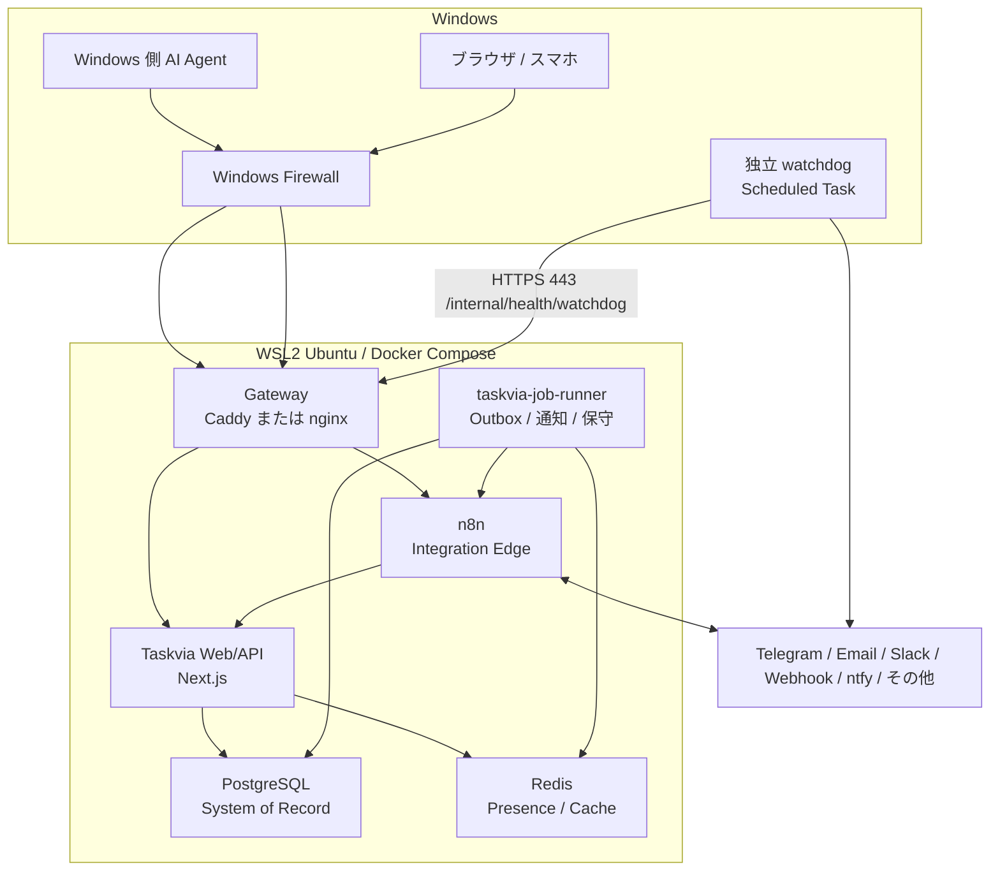
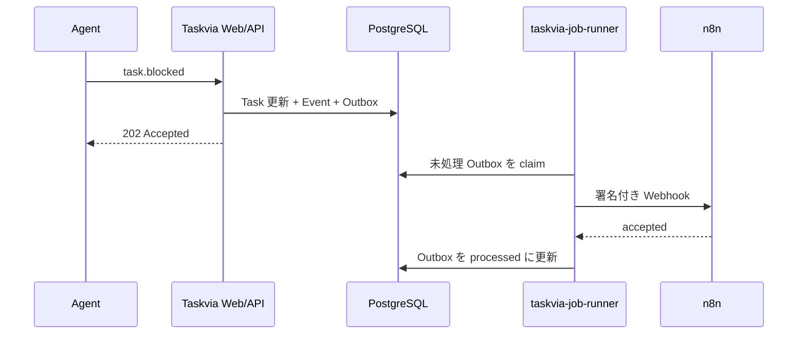

# Taskvia Local Agent Hub Architecture

> Status: Revised draft after Round 2 architecture review  
> Updated: 2026-07-20  
> Scope: Windows + WSL2 (Ubuntu) 上で動作する、AI エージェント向けローカル Taskvia 基盤

## 1. この文書の目的

Taskvia は現在、次の機能を持つマルチエージェント向けシステムである。

- Mission を Task に分解してカンバン表示する
- Task の依存関係、担当 Agent、進捗を管理する
- Agent のツール実行要求をブラウザなどから承認・拒否する
- verification と rework の結果を記録する
- Agent の状態、作業ログ、ナレッジを収集する

今後はこれを単なる承認ボードではなく、次の役割を持つ **Agent Coordination Hub** へ拡張する。

> Mission を分解し、Agent に配り、Agent 間の協調を記録し、例外だけを人間へ上げる制御面。

本書では、そのためのローカルサーバー構成、データ境界、非同期処理、通知、外部連携、将来の Temporal 導入方針を整理する。

## 2. 設計原則

### 2.1 Task を中心に通信を構造化する

Taskvia を Agent 用チャットにするのではなく、すべての通信を Mission / Task / Approval / Verification に紐づくイベントとして扱う。

自由形式チャットだけを増やすと、コンテキスト肥大化、重複依頼、無限応答、監査不能が起きやすい。通信種別は構造化し、本文や成果物は必要に応じて参照として添付する。

### 2.2 PostgreSQL を業務上の正本にする

Mission、Task、メッセージ、承認、検証、履歴、永続記憶は PostgreSQL に保存する。

Redis は正本にせず、オンライン状態、キャッシュ、短命な待機状態、重複排除などに限定する。

### 2.3 不安定な外部処理を Web/API から分離する

Taskvia Web/API は入力検証と PostgreSQL transaction の確定までを担当する。通知、外部 Webhook、再送、期限切れ処理は `taskvia-job-runner` が非同期で行う。

### 2.4 n8n を Integration Edge として使う

n8n は Taskvia の正本や状態機械ではなく、Telegram、Slack、Teams、Email、GitHub、Notion など外部サービスとの接続と運用自動化を担当する。

### 2.5 通知手段を Taskvia の中心概念にしない

ntfy、Telegram、Email、Slack、Generic Webhook などは交換可能な Provider として扱う。

Taskvia の中心概念は「誰に、何を、どの緊急度で届け、確認されたか」である。

### 2.6 障害時にも記録を失わない

業務状態の変更、対応する `mission_events` の追記、その変更から発生する `outbox_events` の追加は、**必ず同一 PostgreSQL transaction 内で原子的に確定する**。いずれか 1 つでも失敗した場合はすべて rollback し、片側だけを更新してはならない。外部配送を伴わない状態変更でも、業務上の変更理由を表す `mission_events` は同じ transaction に含める。

n8n や通知先が停止しても PostgreSQL に未配送イベントが残り、復旧後に再送できる構成とする。Web/API の transaction 内では外部 API を呼び出さない。

## 3. 目標アーキテクチャ



## 4. サービスごとの責務

| サービス | 主な責務 | 正本を持つか | ホスト公開 |
|---|---|---:|---:|
| `gateway` | HTTPS、Taskvia / n8n の振り分け | No | `80/443` のみ |
| `taskvia-web` | Board、API、認証、承認画面 | No | 内部 `3000` |
| `taskvia-job-runner` | Outbox 配送、retry、timeout、通知ルーティング | No | なし |
| `postgres` | Mission、Task、Event、Approval、Memory | Yes | なし |
| `redis` | heartbeat、cache、短命な待機状態 | No | なし |
| `n8n` | 外部サービス連携、定期処理、データ変換 | No | gateway 経由 |
| `backup` | PostgreSQL backup、世代管理 | No | なし |
| Windows watchdog | service / job runner / backup の外形監視と独立通知 | No | なし |

PostgreSQL、Redis、n8n の内部ポートは Windows や LAN に直接公開しない。開発時に DB クライアントを接続する場合も、原則 `127.0.0.1` bind に限定する。

既存 API と UI における `Worker` は Agent の稼働記録を表す domain 用語として維持する。非同期処理 process は必ず `Job Runner` / `taskvia-job-runner` と呼び、service 名、log category、metric label、source path で `worker` 単独の名称を使わない。

## 5. PostgreSQL の設計

### 5.1 Database の分離

1 つの PostgreSQL instance を共有してもよいが、Taskvia と n8n は database と user を分離する。

```text
database: taskvia
user:     taskvia_app

database: n8n
user:     n8n_app
```

n8n から Taskvia のテーブルへ直接書き込まない。すべて Taskvia API を経由させる。

### 5.2 Taskvia の主要テーブル案

```text
missions
tasks
task_dependencies
agents
messages
message_receipts
approvals
approval_tokens
verification_runs
artifacts
memories
mission_events
outbox_events
inbound_events
notification_channels
notification_rules
notification_deliveries
operation_alerts
service_heartbeats
backup_runs
restore_tests
```

### 5.3 現在状態と履歴を分ける

`tasks.status` は Board を高速に表示するための現在状態として保持する。

`mission_events` は append-only の監査履歴とし、「なぜその状態になったか」を残す。

状態遷移を行う Repository は、次の transaction 境界を共通実装として提供する。

```text
BEGIN
  1. 現在状態を検証し、missions / tasks / approvals / verification_runs を更新
  2. 対応する mission_events を append
  3. 外部配送または非同期処理が必要なら outbox_events を append
COMMIT
```

API Route や Server Action から上記 3 書込を個別に呼び分けることは禁止する。各イベントには `event_id`、対象 aggregate、aggregate 内の連番、causation / correlation ID を持たせ、同一 aggregate の順序と追跡可能性を保つ。

イベント例:

```text
mission.created
task.created
task.assigned
task.started
task.progress
task.blocked
task.handoff
message.sent
message.acknowledged
approval.requested
approval.decided
approval.expired
verification.started
verification.failed
verification.passed
task.reworked
task.completed
mission.completed
```

## 6. Agent 間コミュニケーション

### 6.1 共通 Envelope

```ts
type AgentMessage = {
  id: string;
  type:
    | "task.assign"
    | "task.progress"
    | "task.blocked"
    | "task.handoff"
    | "question"
    | "answer"
    | "approval.request"
    | "approval.decision"
    | "verification.result";

  mission_slug: string;
  task_id?: string;
  thread_id: string;

  from: string;
  to: string[];

  payload: unknown;
  correlation_id?: string;
  causation_id?: string;
  hop_count: number;
  max_hops: number;
  requires_ack: boolean;

  created_at: string;
  expires_at?: string;
};
```

### 6.2 必要な通信特性

- `id` による重複排除
- `correlation_id` による質問と回答の対応
- 受信 ACK と処理完了の分離
- 未 ACK メッセージの再配送
- Agent offline 時の PostgreSQL 保持
- メッセージ数、再試行回数、Agent 間往復回数の上限
- メッセージ本文を信頼できない入力として扱う
- 大きな成果物は本文ではなく Artifact 参照にする

### 6.3 ACK 再配送とループブレーカ

ACK は「受信者の Inbox に永続化された」ことだけを表し、処理成功や Task 完了とは分離する。`message_receipts` は `(message_id, recipient_id)` を一意制約とし、同じ ACK を何度受けても結果が変わらないようにする。

初期値として、未 ACK 再配送は指数 backoff 付きで最大 5 回、Agent 間の因果連鎖は `max_hops = 8`、同一 thread の自動メッセージは最大 100 件とする。上限値は設定可能にするが、無制限は許可しない。次のいずれかに達したメッセージは自動配送を停止し、`message.delivery_exhausted` または `message.loop_blocked` Event を記録して人間へ警告する。

- `attempts >= max_attempts`
- `hop_count >= max_hops`
- `expires_at` 超過
- 同じ `causation_id` が因果 chain 内に再出現

回答を生成する側は元メッセージの `correlation_id` を引き継ぎ、`causation_id` に直接の親 message ID を設定し、`hop_count` を 1 増やす。wait timeout 後に再質問を新規 chain として自動生成してはならず、再開には人間または明示的な retry 操作を要求する。

## 7. 永続記憶

会話ログをそのまま永続記憶とせず、Mission Event から抽出された事実、決定、手順、教訓を別テーブルへ保存する。

```ts
type Memory = {
  id: string;
  scope: "global" | "project" | "mission" | "agent";
  kind: "fact" | "decision" | "procedure" | "lesson";
  content: string;
  source_event_ids: string[];
  confidence: number;
  superseded_by?: string;
  created_at: string;
};
```

将来 `pgvector` を使った意味検索を追加できるが、embedding を唯一の記憶にしない。必ず元 Event や Artifact に辿れるようにする。

## 8. Redis の役割

Redis には、失われても PostgreSQL から再構築できるデータを置く。

```text
presence:{agent}           TTL 120 秒
approval:wait:{id}         TTL 10 分
idempotency:{event_id}     TTL 24 時間
cache:mission:{slug}
unread:{agent}
rate_limit:{agent}
```

想定用途:

- Agent heartbeat と online/offline 判定
- 承認 hook の高速 polling
- 未読件数
- UI cache
- rate limit
- 排他制御
- idempotency key
- UI 更新通知

Redis は AOF を有効にして再起動耐性を上げてもよいが、Redis backup だけで Taskvia を復元する設計にはしない。

### 8.1 現行実装からの変更

現行 Taskvia は `@upstash/redis` と `Redis.fromEnv()` による REST 接続が各 API に広がっている。通常のローカル Redis へ接続するため、`node-redis` など TCP 対応 client へ置き換える。

直接呼び出しを一括置換する前に、次の境界を導入する。

```text
src/server/db/
  postgres.ts
  redis.ts

src/server/repositories/
  mission-repository.ts
  task-repository.ts
  approval-repository.ts
  event-repository.ts
  notification-repository.ts
```

API Route、Server Action、job runner は共通 Repository を利用する。

現行の Redis Action Token は移行期間中も GET → check → SET に戻してはならず、Lua または WATCH/CAS による単一の原子操作で消費する。目標構成では Action Token の hash と消費状態を PostgreSQL に保存し、次の条件付き更新を Approval 決定・`mission_events`・Outbox と同一 transaction 内で行う。

```sql
UPDATE approval_tokens
SET consumed_at = now(), decision = $decision
WHERE token_hash = $token_hash
  AND consumed_at IS NULL
  AND expires_at > now()
RETURNING approval_id;
```

Redis の `approval:wait:*` はこの決定を反映する polling cache に限定し、承認結果の正本にはしない。

### 8.2 Cache consistency と Redis 障害時の方針

PostgreSQL row に単調増加する `version` を持たせ、cache 更新は commit 後に job runner が行う。Redis へ書く際は保存済み version より新しい場合だけ更新し、TTL を必須にする。認証・認可、承認決定、idempotency の最終判定には cache 値を使用しない。

| Redis 用途 | 障害時の挙動 |
|---|---|
| `cache:*` / `unread:*` | cache を bypass して PostgreSQL から取得する |
| `presence:*` | online と断定せず `unknown` と表示する |
| `approval:wait:*` | PostgreSQL polling に fallback する |
| `idempotency:*` | PostgreSQL の受信イベント一意制約で判定する |
| `rate_limit:*` | public mutation / destructive endpoint は fail-closed、内部 read は制限付き継続 |
| UI 更新通知 | polling に fallback する |

Redis 復旧時は PostgreSQL の version を基準に再構築し、古い cache を正本へ書き戻してはならない。

## 9. taskvia-job-runner

### 9.1 job runner とは何か

`taskvia-job-runner` は AI Agent や既存 domain の Worker ではなく、Taskvia Web/API と別に常駐する非同期処理専用の Node.js process である。

Web/API は request を受け付けて PostgreSQL transaction を確定し、job runner がその後の配送、retry、timeout、cache 更新を行う。

### 9.2 初期責務

初期実装では次の 3 つに絞る。

1. Transactional Outbox の配送
2. Approval の期限切れ処理
3. stale Agent の検出

将来追加する候補:

- 通知ルーティングと fallback
- Agent Inbox への配送
- 未 ACK メッセージ再送
- Redis cache invalidation
- blocked 長期化の検出
- deadline 超過検出
- Mission 完了条件の確認
- dead letter の生成
- Memory 抽出処理の起点
- n8n callback 未着の検出

### 9.3 Transactional Outbox



`outbox_events` の例:

```ts
type OutboxEvent = {
  id: string;
  event_id: string;
  aggregate_id: string;
  aggregate_sequence: number;
  type: string;
  payload: unknown;
  status: "pending" | "processing" | "processed" | "dead" | "skipped";
  ordering_policy: "best_effort" | "strict";
  attempts: number;
  available_at: string;
  locked_by: string | null;
  lock_token: string | null;
  locked_until: string | null;
  blocked_by_event_id: string | null;
  processed_at: string | null;
  dead_at: string | null;
  resolved_at: string | null;
  resolved_by: string | null;
  resolution: "retried" | "skipped" | null;
  last_error?: string;
};
```

job runner は外部通信中に PostgreSQL transaction を開いたままにしない。初期値は 1 batch 20 件、lease 60 秒、外部通信 timeout 15 秒とし、実測に基づいて調整する。claim は次の短い transaction で行う。

1. `status IN ('pending', 'processing')`、`available_at <= now()`、かつ lease が未取得または期限切れの行を `ORDER BY available_at, id FOR UPDATE SKIP LOCKED` で選ぶ。
2. `status = 'processing'`、`locked_by`、ランダムな `lock_token`、`locked_until = now() + lease_duration` を設定し、`attempts` を 1 増やして commit する。外部通信 timeout は lease duration より短くする。
3. transaction 外で外部配送する。
4. 成功時は `WHERE id = ? AND lock_token = ?` を条件に `processed` へ更新する。失敗時も同じ条件で `available_at` を backoff 後へ進めて lock を解放するか、attempt 上限なら dead letter へ遷移する。

job runner が停止して lease が切れた行は別 instance が再取得する。期限切れ後に復帰した古い instance の完了更新は `lock_token` 不一致で拒否する。これにより配送は at-least-once となるため、下流の冪等化は必須である。`ordering_policy = 'strict'` の event は、先行する `aggregate_sequence` が `processed` または監査付きで `skipped` になるまで後続を claim しない。

Taskvia の受信 endpoint は `(source, event_id)` の一意制約を持つ `inbound_events` に、payload hash と受信結果を保存する。n8n / Provider にも同等の永続 idempotency store を要求し、保持期間は Outbox の自動 retry・手動 replay 可能期間以上とする。保持期間を過ぎた手動再送は同じ `event_id` を使わず、新しい `event_id` と `replay_of` を発行する。

### 9.4 Retry と Dead Letter

例:

```text
1 回目失敗  -> 10 秒後
2 回目失敗  -> 1 分後
3 回目失敗  -> 5 分後
4 回目失敗  -> 30 分後
5 回失敗    -> dead letter
```

失敗を無限に隠さず、最終的に Taskvia UI へ配送失敗として表示し、§17 の out-of-band channel にも警告する。

dead letter 化、lease 期限切れの反復、pending 最古時刻の閾値超過は §17 の運用警告対象とする。

### 9.5 Dead Letter と順序バリアの解決

`ordering_policy = 'strict'` の先行 event が dead letter になった場合は、**同一 aggregate の後続を自動解放しない**。後続を `blocked_by_event_id` で論理的に停止し、aggregate 単位の高優先度 alert を生成する。後続の期限や件数が増えても、自動 skip や別順序での配送は行わない。

Taskvia Operator は `admin` scope と明示確認を伴う UI から次のどちらかを選ぶ。

- Retry: dead event を同じ `event_id` のまま `pending` に戻し、手動 retry 回数と理由を記録する。受信側 idempotency により、ACK 喪失後の再送でも副作用を重複させない。
- Skip and release: `resolved_by` と理由を必須にして `skipped` へ遷移し、`outbox.delivery_skipped` を `mission_events` に追記して後続を解放する。

解決操作、監査 Event、status 更新は同一 PostgreSQL transaction で行う。`best_effort` event は dead letter を終端状態として後続を解放できるが、dead letter 自体の alert と監査記録は残す。ordering policy は event type ごとに事前定義し、発行側が request payload から任意変更できないようにする。

### 9.6 Process 構成

Taskvia と同じ repository、同じ container image を使い、起動 command を分ける案とする。

```text
taskvia-web
  command: npm run start

taskvia-job-runner
  command: npm run jobs
```

```text
src/server/jobs/
  dispatch-outbox.ts
  expire-approvals.ts
  detect-stale-agents.ts
  route-notification.ts

src/server/job-runner.ts
```

job runner は外部公開 port を持たず、heartbeat を PostgreSQL に 30 秒間隔で記録する。process 自身の Docker health check は内部 command で行い、Windows watchdog からは §14.2 の集約 health endpoint 経由で確認する。

## 10. n8n

### 10.1 担当範囲

n8n は Integration Edge として次を担当する。

- Telegram、Email、Slack、Teams、GitHub、Notion などとの接続
- 外部 Webhook の受信と Taskvia event への正規化
- 日次・週次 summary
- blocked escalation
- Mission 完了時の外部 archive
- 外部フォームやメールから Mission Request を作成
- 通知 payload の provider 固有形式への変換

### 10.2 担当させない範囲

- Mission / Task の正本
- Approval 履歴の唯一の保存先
- Agent 間メッセージの唯一の保存先
- Taskvia の最終的な権限判定
- Taskvia 固有の複雑な状態機械
- 永続的な監査ログ

n8n から Taskvia 状態を変更するときは、Taskvia API を呼び出す。

### 10.3 初期 Workflow 候補

1. `taskvia-event-router`
   - Event type、severity、user preferences によって通知先を分ける
2. `mission-intake`
   - Email、Webhook、Form、GitHub Issue から Mission Request を作る
3. `blocked-escalation`
   - 一定時間 blocked の Task を抽出して通知する
4. `daily-digest`
   - 進行中 Mission、blocked Task、pending approval を要約する
5. `knowledge-archive`
   - 完了 Mission の記録を外部サービスへ archive する

### 10.4 n8n 自身の永続化

n8n は専用 PostgreSQL database を利用する。将来 queue mode を使う場合は n8n 自身も Redis を必要とするが、Taskvia 用 Redis との安易な共有は避ける。別 instance、または少なくとも明確に分離した ACL / keyspace を使う。

初期の単一ノード運用では n8n queue mode は不要。

## 11. 汎用通知モデル

### 11.1 Notification Intent

Taskvia は「Telegram に送る」のではなく、「対象ユーザーへ承認要求を通知する」という Intent を作る。

```ts
type NotificationIntent = {
  id: string;
  event_id: string;

  kind:
    | "approval.requested"
    | "task.blocked"
    | "task.assigned"
    | "message.received"
    | "mission.completed"
    | "delivery.failed"
    | "operation.alert";

  recipients: Array<{
    type: "user" | "agent" | "role";
    id: string;
  }>;

  severity: "info" | "normal" | "urgent";
  title: string;
  body: string;

  action?: {
    type: "open" | "approve_or_deny";
    url: string;
    expires_at?: string;
  };

  mission_slug?: string;
  task_id?: string;
  payload: Record<string, unknown>;
  created_at: string;
};
```

### 11.2 Channel と Rule

```text
notification_channels
  id
  owner_id
  type                  in_app | webhook | n8n | telegram | email | ntfy
  display_name
  config_encrypted
  enabled

notification_rules
  event_type
  severity
  channel_id
  priority
  quiet_hours
  fallback_after_seconds

notification_deliveries
  notification_id
  channel_id
  status                pending | sending | sent | failed
  provider_message_id
  attempts
  last_error
  sent_at
  acknowledged_at
```

ルール例:

```text
urgent approval
  -> Telegram
  -> 30 秒失敗なら Generic Webhook
  -> 2 分未確認なら Email

task assigned
  -> In-app のみ

task blocked
  -> In-app + Telegram
  -> 夜間は Telegram を抑止

mission completed
  -> In-app + Slack
```

### 11.3 Provider 境界

```ts
interface NotificationProvider {
  send(
    notification: NotificationIntent,
    channel: NotificationChannel,
  ): Promise<DeliveryResult>;
}
```

候補:

```text
InAppProvider
GenericWebhookProvider
N8nProvider
TelegramProvider
EmailProvider
NtfyProvider
```

初期は `InAppProvider`、`GenericWebhookProvider`、`N8nProvider` の 3 つを優先する。Telegram、Email、Slack、ntfy などはまず n8n で接続し、信頼性や頻度が必要になったものだけ direct Provider を実装する。

### 11.4 Generic Webhook

Taskvia からの共通 payload 例:

```json
{
  "id": "notification-123",
  "event_id": "event-456",
  "type": "approval.requested",
  "severity": "urgent",
  "title": "ツール実行の承認要求",
  "body": "Agent Kai が Bash の実行を要求しています",
  "action": {
    "approve_url": "https://taskvia.example/api/actions/...",
    "deny_url": "https://taskvia.example/api/actions/...",
    "expires_at": "2026-07-20T12:00:00Z"
  }
}
```

Header:

```text
X-Taskvia-Event-Id
X-Taskvia-Timestamp
X-Taskvia-Signature
```

受信側は HMAC signature、timestamp、`event_id` を検証する。

署名検証は raw request body に対して timing-safe comparison で行い、許容時刻差を超えた request を拒否する。署名が正しくても `(source, event_id)` が処理済みなら保存済みの結果を返し、副作用を再実行しない。署名方式、secret rotation、timestamp 許容幅、idempotency 保持期間を Phase 4 着手前に contract test とともに確定する。

## 12. Approval

### 12.1 Channel 非依存の Action Token

承認を Telegram、ntfy、Email など特定 channel の callback model に依存させない。

Taskvia が短命な one-time Action Token を発行し、各 channel はその URL を表現するだけにする。

```text
Taskvia
  -> Approval Action Token 発行
  -> Notification Intent に action URL を含める

Telegram
  -> Inline Button
  -> n8n callback
  -> Taskvia Approval API

Email
  -> Approve / Deny link
  -> Taskvia Approval API

Generic Webhook
  -> 任意 UI / Bot
  -> Taskvia Approval API
```

Token に結びつける情報:

- `approval_id`
- 許可された decision
- 対象 user / role
- expiry
- one-time use
- 発行元 `event_id`

どの channel から決定しても、最終結果は PostgreSQL の `approvals` と `mission_events` に保存する。

raw token は保存せず hash のみを一意制約付きで保存する。Token 消費は `consumed_at IS NULL AND expires_at > now()` を条件とする PostgreSQL の単一更新で行い、Approval 決定、Event、Outbox と同一 transaction に含める。n8n callback は Action Token だけに依存せず、integration scope の認証または HMAC、timestamp、callback `event_id` の idempotency を併用する。

## 13. Web/API、job runner、n8n の境界

| Taskvia Web/API | taskvia-job-runner | n8n |
|---|---|---|
| 入力検証 | Outbox claim | 外部 API 接続 |
| 認証・認可 | retry / backoff | payload 変換 |
| DB transaction | timeout 検出 | 外部 routing |
| 現在状態の更新 | cache 更新 | Schedule automation |
| Event / Outbox 追加 | Agent Inbox 配送 | Telegram / Email / Slack |
| UI / Approval | dead letter | 外部 Mission intake |

重要な保証:

> n8n が停止しても、Taskvia の状態変更と監査記録は壊れない。

## 14. WSL2 ローカルサーバー構成

### 14.1 配置

```text
/opt/taskvia/
  compose.yaml
  .env
  operations.yaml
  gateway/
  backups/
```

Code と永続 volume は `C:\` を直接 bind mount するのではなく、WSL の Linux filesystem または Docker named volume に置く。

```text
taskvia_pg_data
taskvia_redis_data
n8n_data
```

### 14.2 Network

同一 Windows machine のみで利用する初期構成:

```text
http://localhost:3000  Taskvia
http://localhost:5678  n8n editor
```

スマホや LAN 内端末から利用する構成:

```text
https://taskvia.home.arpa
https://n8n.home.arpa
```

- 初期構成は WSL2 NAT mode に固定する
- mirrored networking は実機で露出境界を検証し、Windows Firewall ルールを自動適用・再検証できる場合だけ許可する
- Windows Firewall は Private network からの `443` のみ許可し、Public network からは拒否する
- PostgreSQL `5432`、Redis `6379`、n8n 内部 `5678` は LAN に公開しない
- Compose の内部サービスには host port を割り当てない。開発上必要な一時公開も `127.0.0.1` bind に限定する
- n8n editor と n8n webhook の公開範囲を分離する
- 外部 SaaS から inbound webhook が不要なら、初期は LAN 限定にする
- 外部 webhook が必要になった場合だけ tunnel を追加し、`/webhook/*` だけを公開する

Windows watchdog は新しい health port や PostgreSQL / Redis の直接 port を使用せず、既存 gateway の `https://127.0.0.1/internal/health/watchdog` へ `443` で接続する。WSL2 NAT では Docker Desktop の localhost forwarding、または Windows loopback のみに bind した明示的 port forwarding で、この URL を gateway へ到達させる。Phase 0 で Windows host からの実到達を検証し、forwarding の自動復旧も reboot test に含める。

`/internal/health/watchdog` は次だけを返す集約 endpoint とする。

- Web process の liveness / readiness
- PostgreSQL / Redis / n8n の `healthy | degraded | unreachable`
- PostgreSQL に記録された job runner heartbeat の最終時刻
- backup success marker と restore test の最終時刻

endpoint は health 読取専用の `watchdog` scope token を timing-safe に検証する。raw token は Windows Credential Manager、token hash は PostgreSQL に依存しない WSL secret file に分離して保持する。dependency 障害時も認証を迂回してはならない。応答には接続文字列、内部 hostname、version 詳細、error stack を含めない。LAN 経由の同 path にも同じ認証を要求し、失敗を rate limit と security log の対象にする。

この経路は既存 `443` の用途であり、「LAN から `443` 以外へ到達不可」という境界の例外にはしない。localhost forwarding が確立できない環境では Phase 0 DoD を未達とし、内部 service port の公開で迂回してはならない。

### 14.3 起動

初期運用は Docker Desktop の WSL2 backend が簡単である。

24 時間の無人運用を重視する場合は Ubuntu 内 Docker Engine + systemd も候補だが、Windows 起動時の Scheduled Task、sleep 無効化、reboot 後の自動復旧試験が必要。

## 15. Security

### 15.1 現行認証の課題

現在は `TASKVIA_TOKEN` が未設定だと open mode になる。目標構成では、初期移行中は `TASKVIA_TOKEN`、scope 移行後は必須 scoped token のいずれかが未設定または空白のみなら server startup / deployment health check を失敗させ、**既定で fail-fast** とする。

開発時に限り `TASKVIA_ALLOW_INSECURE_OPEN=true` の明示指定で open mode を許可できるが、その場合は loopback bind に固定し、起動ログと UI に常時警告を表示する。本番 profile、LAN bind、tunnel 公開との併用は禁止する。

将来は scope を分ける。

```text
agent-token        Agent からの Task / Message 投入
approver-token     Approval / Deny
integration-token  n8n / Webhook 通信
admin-token        Delete / 設定変更 / Export
```

scope token への移行は次の順序で行う。

1. endpoint ごとの必要 scope を確定し、新 token を発行する。
2. client を scoped token へ切り替える。移行期間だけ期限付き feature flag で旧 token を受理し、利用を audit log と警告に残す。
3. 全 client の切替確認後、旧 `TASKVIA_TOKEN` fallback を無効化する。
4. production では fallback を再有効化できないよう構成検証する。

無期限の後方互換や、旧 token を全 scope として暗黙に扱う実装は禁止する。

legacy token の一時受理には、次の 2 設定を両方必須とする。

```text
TASKVIA_ACCEPT_LEGACY_TOKEN=true
TASKVIA_LEGACY_TOKEN_EXPIRES_AT=<U-24 で確定した UTC timestamp>
```

受理期限は Phase 1 着手前に U-24 へ絶対日時として記録し、code review 対象の migration manifest に hard deadline として固定する。環境変数の日時は hard deadline と同じか、それより前だけを許可する。受理 flag が true なのに期限が未設定、不正、既に超過、または hard deadline より後なら startup validation を失敗させる。長時間稼働中の process が期限を越えて受理し続けないよう、認証 middleware も request ごとに現在時刻を比較し、期限到達後は旧 token を拒否する。期限延長は単なる環境変数変更では行えず、migration manifest の review、新しい security decision、audit 記録を要求する。

### 15.2 必要な保護

- n8n Webhook に JWT または HMAC signature
- `event_id` による duplicate protection
- Redis を Docker 内部 network に限定
- PostgreSQL user を Taskvia / n8n で分離
- secret を repository に commit しない
- n8n editor を public internet に公開しない
- Agent message を untrusted input として検証
- destructive action は role / scope / human approval を要求
- webhook endpoint に rate limit
- Approval Token は短命、one-time、user-bound

追加要件:

- n8n editor は管理端末または管理 VPN からだけ到達可能にし、通常の webhook 公開面と分離する
- n8n credential は接続先ごとに最小権限化し、任意コード・shell・community node の利用を allowlist で制限する
- Agent 由来の title / body / URL / Markdown / header は schema、長さ、許可 scheme を検証し、各出力先に合わせて escape する
- rate limit は gateway と application の両方で実装し、認証主体・source IP・endpoint class ごとに原子的に加算する
- Redis 障害時、外部公開 mutation、callback、destructive action の rate limit は fail-closed とする
- security event と拒否理由は secret や raw Action Token を含めず監査ログへ記録する

## 16. Backup と復旧

各 deployment は repository 外の deployment-local 設定に、実在する担当者の氏名または一意な operator ID と連絡先を登録する。`Operations` のような役割名だけ、空欄、通知不能な宛先は許可しない。同一人物が複数責務を兼任してもよい。

| 責務 | 実施主体 | 最低限の責務 |
|---|---|---|
| Taskvia Operator | `operator_owner` | 日次 alert 確認、dead-letter 解決、月次 restore test |
| Backup Owner | `backup_owner` | backup 成否、保存先容量、世代、復号可能性の確認 |
| Security Owner | `security_owner` | watchdog / scoped token、Firewall、secret rotation の管理 |

Phase 0 の deployment validation は 3 owner の identity と alert destination が設定済みであることを確認する。backup / restore / alert acknowledgement には実施した owner ID を記録する。

### 16.1 PostgreSQL

夜間 backup:

```text
pg_dump -Fc taskvia
pg_dump -Fc n8n
```

保持例:

```text
日次 7 世代
週次 4 世代
```

backup は WSL virtual disk とは別の物理的・論理的保存先へコピーする。

```text
D:\TaskviaBackups
外付け SSD
NAS
```

backup job は専用の最小権限 user で実行し、暗号化、checksum 検証、世代管理がすべて成功した時点だけ成功記録を更新する。Taskvia DB と n8n DB の dump 開始・終了時刻、schema version、application version を manifest に保存し、2 database 間の recovery point 差を確認できるようにする。

### 16.2 n8n

PostgreSQL に加え、以下を backup 対象にする。

- `N8N_ENCRYPTION_KEY`
- n8n configuration
- Workflow export
- OAuth credential configuration
- gateway certificate / CA

`N8N_ENCRYPTION_KEY` と暗号化済み backup を同じ媒体・同じ資格情報だけで取得できる場所に置かない。key の復旧手順は backup 手順とは別に保管し、双方が揃わないと n8n credential を復号できないことを restore test で確認する。

### 16.3 Redis

Redis AOF / RDB も保持できるが、Redis は cache / transient state として扱い、PostgreSQL から再構築可能にする。

### 16.4 Restore Test

月 1 回を目安に空環境への restore を確認する。backup の作成成功だけではなく、Taskvia と n8n が復旧できることを確認する。実行者、使用 backup、開始・終了時刻、復旧した schema / application version、検証結果、次回期限を PostgreSQL の運用記録へ保存する。

restore test では Taskvia と n8n の起動だけでなく、Mission / Approval の参照、暗号化済み n8n credential の復号、署名付き test webhook、未処理 Outbox の再開を確認する。本番宛て通知は無効化した隔離 network で実施する。

## 17. 可観測性、監視、アラート

24 時間無人運用では、失敗を記録するだけでなく、人間が Taskvia を開いていない時間にも異常を届ける。Taskvia UI の警告は主要な表示面とするが、それだけを alert delivery path にはしない。

### 17.1 最低限収集する signal

| Signal | 初期 warning 条件 | 目的 |
|---|---|---|
| web readiness | 2 回連続失敗 | API / PostgreSQL 接続異常の検知 |
| job runner heartbeat | 2 分以上更新なし | process 停止・event loop 停滞の検知 |
| Outbox pending 件数・最古時刻 | 最古 5 分超 | job runner 停止や下流遅延の早期検知 |
| Outbox dead letter 件数 | 1 件以上 | 配送不能の検知 |
| lease 期限切れ回数 | 10 分内に 3 回以上 | job runner crash / timeout 設定不良の検知 |
| PostgreSQL / Redis / n8n health | 2 回連続失敗 | dependency 障害の検知 |
| 直近 backup 成功時刻 | 26 時間以上更新なし | 日次 backup 脱落の検知 |
| 直近 restore test 実行日 | 35 日以上更新なし | 復旧可能性の陳腐化検知 |
| n8n callback 未着件数 | callback deadline 超過 | 外部連携の片方向障害検知 |

閾値は設定可能にするが、無効化には理由と期限を要求する。counter だけでなく最終成功時刻と最古未処理時刻を保存し、「処理が 0 件だから正常」と誤判定しないようにする。

### 17.2 警告の配送

同じ原因の警告は dedup key で集約し、`active` / `acknowledged` / `resolved` の状態と初回・最終検知時刻を保存する。警告発生時は次の両方を行う。

1. Taskvia UI の全画面 banner と運用 dashboard に表示する。
2. `operation.alert` を少なくとも 1 つの out-of-band channel（ntfy、Email など）へ送る。

job runner 自身の停止、PostgreSQL 停止、Taskvia 全体停止は Taskvia 内部から通知できない。そのため Docker / systemd の外側で動く Windows Scheduled Task または独立 watchdog が health endpoint、job runner heartbeat、backup marker を監視し、Taskvia の job runner を経由せず外部通知できるようにする。watchdog の設定と資格情報は Taskvia DB だけに依存させない。

watchdog の資格情報と Scheduled Task は Security Owner、日々の alert acknowledgement は Taskvia Operator、backup / restore freshness の是正は Backup Owner が担当する。未 acknowledgement が 24 時間続いた場合は deployment-local 設定の escalation destination へ再通知する。

警告の配送失敗も別 signal として記録し、通知 storm を避けるため backoff と繰り返し上限を設ける。復旧時には resolved 通知を 1 回送る。

### 17.3 Log と追跡

Web/API、job runner、n8n callback は JSON structured log を出力し、`event_id`、`correlation_id`、`mission_slug`、`task_id`、`delivery_id` を可能な範囲で共通 field として持つ。raw Action Token、Authorization header、credential、未加工の機密 payload は log に残さない。

運用 dashboard から Mission Event、Outbox、Delivery、Alert、backup / restore 記録へ辿れるようにする。log 保持期間と disk 上限を設定し、容量枯渇自体も監視対象にする。

## 18. Test Strategy と Definition of Done

設計上の保証はテスト可能な契約として扱う。各 Phase は機能実装だけでなく、該当する failure test が通るまで完了としない。

### 18.1 必須 test layer

- Unit: state transition、scope 判定、retry / backoff、payload validation
- PostgreSQL integration: 状態・Event・Outbox の rollback、unique constraint、Action Token 同時消費、Outbox lease 再取得、strict dead-letter 順序バリア
- Redis integration: Lua/CAS、version 付き cache 更新、障害時 fallback / fail-closed
- Contract: Webhook HMAC、timestamp、`event_id` idempotency、n8n callback schema
- End-to-end: Approval request → 通知 → callback → Agent polling
- Failure injection: job runner crash、n8n 停止、Redis 停止、network timeout、lease 期限切れ、重複配送
- Security negative: token 未設定起動、scope 不一致、legacy flag の期限欠落・超過・稼働中失効、rate limit、期限切れ Action Token、悪意ある URL / Markdown / oversized payload
- Operations: backup 作成、隔離環境 restore、reboot 後の自動復旧、NAT + `443` 経由 watchdog health、watchdog の実通知

外部サービスを必要としない test は CI で毎回実行する。PostgreSQL / Redis を mock した test だけで原子性や競合制御の完了条件を満たしたことにはしない。

### 18.2 共通 DoD

- migration に forward / rollback 手順と、rollback できない境界が記録されている
- 新規 mutation に認証・認可・入力検証・audit Event の test がある
- async 処理に idempotency、retry 上限、timeout、dead letter、crash recovery の test がある
- dashboard signal と alert rule が実装され、意図的な障害で通知を確認している
- secret を含む log / fixture / artifact が生成されないことを確認している
- runbook と運用責任者が定義されている

## 19. Temporal の位置づけ

Temporal は初期構成には含めず、将来の durable orchestration として追加できるよう境界を保つ。

Temporal を導入する条件:

- 数分から数日にわたる Mission
- 複数 Agent の並列 Task
- Agent offline 後の正確な再開
- 複雑な retry / timeout / cancellation
- human approval 待ち
- verification と最大 N 回の rework
- 補償処理

役割分担:

```text
PostgreSQL
  -> Taskvia の業務上の正本

Redis
  -> presence / cache / short-lived coordination

n8n
  -> external integrations / operational automation

Temporal
  -> durable Mission orchestration

taskvia-job-runner
  -> outbox / cache / lightweight maintenance
```

Temporal 導入後も Outbox、cache、軽量保守のための `taskvia-job-runner` は残せる。Temporal Activity Worker と統合するかは将来判断する。

## 20. 段階導入案

### Phase 0: Local Foundation

- WSL2 + Docker Compose
- Taskvia / PostgreSQL / Redis / n8n / gateway
- WSL2 NAT mode 固定。mirrored mode を使う場合は実機露出試験と Firewall rule を必須化
- 必須 token 未設定・空白時の fail-fast と、scoped token 移行方針
- service health check、独立 watchdog、UI / out-of-band alert の最小経路
- `443` 経由の認証付き `/internal/health/watchdog` と loopback forwarding
- volume、暗号化 backup、成功 marker、restore test 記録
- Taskvia Operator / Backup Owner / Security Owner の実 identity と連絡先
- PostgreSQL / Redis を使う integration test 基盤
- Windows restart 後の自動復旧確認

Phase 0 DoD:

- **Taskvia 外部の端末から**（LAN / tailnet いずれか。**実運用に使用している平面を必ず含むこと**）、`443` 以外の Taskvia 関連 port に到達できない
  - 注（task_164・乖離3/乖離4 の提督裁定 2026-07-28）: 本項は「`443` 以外へ到達できない」という**否定側の境界条件**のみを要求する。`443` が外部から到達**できる**ことは Phase 0 の要件ではない（現構成では `443` も到達不可であり、要求より厳しい状態にある）。また、実証は**実運用している到達平面**で行う。改訂前の文言は LAN 平面のみを指定していたが、実運用は tailnet 専用であり、検査対象と運用実態が一致していなかった
- Windows watchdog が NAT mode で `https://localhost/internal/health/watchdog` に到達でき、認証失敗時は情報を返さない
  - 注（task_164・乖離1 案Y の提督裁定 2026-07-28）: 改訂前は `https://127.0.0.1/...` と IP literal を指定していたが、実装は `localhost` で動作しており、gateway 証明書に IP SAN が無いため IP literal では TLS が成立しない。SNI はクライアントが自由に設定できるフィールドでありアクセス制御としては機能しないため、両者にセキュリティ境界上の差は実質的に無い。文言を実装に合わせる
- token 未設定・空白の production profile では、`isAuthorized()` を経由する全 API が `401` を返す（fail-closed）
  - 注（task_164・乖離2 + 解除条件3 の提督裁定 2026-07-28）: 改訂前は「起動しない」だったが、実装はプロセス自体は起動し `/api/health` が `503` を返すのみで、他 API は無認証で全許可（open mode）だった。この非対称な劣化を `src/lib/auth.ts` の fail-closed 化で解消し、文言を実装の到達点に合わせた。**本項の対象は `isAuthorized()` を経由する API 平面のみである。** UI ページ平面（`src/proxy.ts` の NextAuth matcher 経路）は本項の対象外であり、`src/proxy.ts:10-11` に同型の open-mode 分岐（token 未設定時に無認証で通過）が存在するが、本ミッションでは変更していない
  - ★表現上の注記: 本項は token 未設定という起動形態に対する防御を追加したものである。Vercel 本番・amun 実機のいずれも `TASKVIA_TOKEN` が常時 SET のため、現行の本番2環境では挙動は変わらない（「本番の穴を塞いだ」という意味ではない）
- web / job runner、backup の疑似障害が Taskvia 外の channel へ通知される
  - 注（task_164・乖離5 の提督裁定 2026-07-28）: **job runner は Phase 0 の構成要素に含まれないため、Phase 0 では該当なし**。job runner の最小実装は Phase 1、その監視能力は Phase 3 で計画されている（§20 各 Phase 参照）。本項の Phase 0 における判定対象は web と backup のみである
- 空環境への restore test が 1 回成功している
- 3 owner の実 identity / alert destination が未設定なら deployment validation が失敗する

### Phase 1: PostgreSQL System of Record

- Repository 層導入
- Mission / Task / Approval / Verification schema
- `mission_events`
- `outbox_events` schema と最小 Outbox dispatcher（In-app + 移行用 `NtfyProvider`）
- status / `mission_events` / Outbox の同一 transaction 実装
- PostgreSQL Action Token の原子消費
- Redis 既存データ migration
- PostgreSQL を正本へ変更
- Approval Token / ntfy の切替 runbook と一括 cutover
- legacy token の絶対失効日時、startup validation、request-time expiry enforcement
- **PostgreSQL を watchdog の `dependency_signals` へ実チェックとして配線する**（`route.ts` の `postgresStatus: DependencyStatus = "unreachable"` 固定値 placeholder を実接続確認へ置換）。**Phase 1 完了後への先送りは禁止**（task_164・解除条件6 の提督裁定 2026-07-28）
  - 理由: Phase 1 は PostgreSQL を system-of-record へ昇格させる工程である。監視から除外されたまま昇格させると、「正本なのに誰も監視していない」状態を新たに固定化してしまう。A7 の UNMET 原因と Phase 1 は独立した層ではなく直接連動する

移行中に Redis と PostgreSQL の両方へ業務状態を dual-write してはならない。shadow read と検証は許可するが、書込の正本は常に一方だけにする。cutover release で全 Approval mutation、Action Token、Event、通知要求を PostgreSQL 経路へ切り替え、旧 Redis Approval write と直接 ntfy publish を同時に停止する。rollback 時も書込先を一方へ戻し、両経路を並行稼働させない。

Phase 1 DoD:

- 状態更新、Event、Outbox のいずれかを故意に失敗させても部分更新が残らない
- 同一 Action Token の並行 approve / deny で成功は 1 件だけになる
- 旧 Redis Approval key と PostgreSQL の split-brain が発生しない cutover / rollback rehearsal が成功する
- delivery provider 停止中も未配送 event が PostgreSQL に残る
- legacy token flag の期限欠落・超過で startup validation が失敗し、稼働中 process も期限到達後の旧 token を拒否する

### Phase 2: Redis の限定利用

- `@upstash/redis` 依存の抽象化
- local Redis client 導入
- heartbeat / cache / idempotency / short-lived approval wait
- Redis 障害時も PostgreSQL を使って degraded operation できる設計

Phase 2 DoD:

- §8.2 の用途別 failure policy を実障害 test で確認する
- stale cache が新しい PostgreSQL state を上書きしない
- Redis 停止中も Approval の正本と audit history を失わない

### Phase 3: taskvia-job-runner の運用強化

- lease / visibility timeout 付き Outbox dispatcher
- Approval expiration
- stale Agent detection
- retry / dead letter
- job runner heartbeat、Outbox age、lease expiry の監視

Phase 3 DoD:

- claim 直後、外部送信中、送信成功直後の各 crash から自動回復する
- lease 切れ後に復帰した stale job runner が状態を上書きできない
- retry 上限到達時に dead letter と UI / out-of-band 警告が生成される
- strict event の dead letter が後続を停止し、監査付き Retry / Skip 以外では解放されない

### Phase 4: Notification Hub

- In-app notification
- Generic signed Webhook
- Channel / Rule / Delivery schema
- n8n provider
- Telegram など 1 channel の end-to-end 検証

Phase 4 着手条件:

- Generic Webhook の署名、secret rotation、timestamp window、idempotency 保持期間が確定している
- n8n callback の認証、schema、idempotency が contract test になっている
- n8n editor と webhook 公開面の分離、credential 最小権限、入力 sanitization、rate limit が確認できる

### Phase 5: Agent Communication Hub

- Agent Inbox
- Message ACK
- Task thread / Activity UI
- blocked / handoff / question / answer
- offline delivery と retry

Phase 5 着手条件:

- Delivery ACK の意味と永続 schema が確定している
- §6.3 の再配送上限、hop / thread 上限、causation loop 検知、wait timeout 後の停止を integration test で確認できる

### Phase 6: External Automation

- Mission intake
- blocked escalation
- daily digest
- external archive

### Phase 7: Temporal Evaluation

- Approval -> Verification -> Rework の限定 PoC
- 効果確認後に Mission Workflow を検討

## 21. 最初の MVP

MVP を security gate の異なる 3 段階に分ける。外部通知が未完成でも Durable Core を検証できるようにし、Phase 4 の仕様を先取りして未署名 callback を公開しない。

### MVP-A: Durable Core（Phase 1）

1. PostgreSQL に Mission / Task / Event / Approval / Action Token を保存する。
2. 状態、`mission_events`、Outbox を同一 transaction で確定する。
3. PostgreSQL の条件付き更新で Action Token を one-time 消費する。
4. 最小 job runner が Outbox を In-app delivery と移行用 `NtfyProvider` へ配送する。
5. job runner 停止中も Event と未配送要求が失われず、復旧後に再開することを確認する。

### MVP-B: Local Operations（Phase 2-3）

1. Redis に Agent presence と Approval polling cache を保存し、停止時に PostgreSQL へ fallback する。
2. Outbox lease、retry、dead letter、crash recovery を有効にする。
3. job runner heartbeat、Outbox age、backup / restore freshness を UI と独立 watchdog で警告する。

### MVP-C: External Notification（Phase 4）

1. job runner が Outbox を署名付き Generic Webhook へ配送する。
2. n8n が Webhook を検証して Telegram へ通知する。
3. Telegram action を認証・idempotency 付き n8n callback から Taskvia Approval API へ戻す。
4. n8n 停止中も Event と未配送通知が失われず、復旧後に重複副作用なしで再開することを確認する。

MVP-C は Phase 4 着手条件がすべて満たされるまで凍結する。

## 22. Decision Register / 未決事項（28件）

未決事項は期限と決定責任を持つ register として管理する。「Phase N 前」はその Phase の実装着手前、「Phase N release 前」は外部利用を開始する前を表す。

| ID | 論点 | 状態 | 解決期限 | 決定責任 |
|---|---|---|---|---|
| U-01 | PostgreSQL schema 詳細と migration / rollback 方針 | 未決 | Phase 1 前 | Data |
| U-02 | ORM / query builder | 未決 | Phase 1 前 | Architecture |
| U-03 | Event schema versioning | 未決 | Phase 1 前 | Data |
| U-04 | Task / Message の tenancy・project 境界 | 未決 | Phase 1 前 | Product / Data |
| U-05 | Agent identity と credential 発行方式 | 未決 | Phase 1 前 | Security |
| U-06 | UI 認証を Google OAuth のままにするか local auth を追加するか | 未決 | Phase 0 release 前 | Security / Product |
| U-07 | LAN 内 HTTPS と certificate 配布方法 | 未決 | Phase 0 release 前 | Operations |
| U-08 | Generic Webhook の canonicalization、署名、rotation、timestamp window、idempotency retention | 未決 | Phase 4 前 | Security / Integration |
| U-09 | Notification rule の継承順序 | 未決 | Phase 4 release 前 | Product |
| U-10 | quiet hours と urgent override | 未決 | Phase 4 release 前 | Product |
| U-11 | Delivery ACK の定義と retention | 未決 | Phase 5 前 | Architecture / Data |
| U-12 | n8n callback の認証、schema、idempotency | 未決 | Phase 4 前 | Security / Integration |
| U-13 | Agent Inbox の PostgreSQL polling / Redis Streams / SSE 選択 | 未決 | Phase 5 前 | Architecture |
| U-14 | Artifact の保存先、容量上限、retention | 未決 | Phase 5 前 | Data / Operations |
| U-15 | Memory の抽出・承認・陳腐化ルール | 未決 | Phase 6 前 | Product / Data |
| U-16 | backup 保存先、暗号化、key 分離、RPO / RTO | 未決 | Phase 0 DoD 前 | Operations / Security |
| U-17 | WSL / Docker の自動起動方式 | 未決 | Phase 0 DoD 前 | Operations |
| U-18 | 外部アクセス時の VPN / tunnel と公開 path | 未決 | 外部公開前 | Security / Operations |
| U-19 | Temporal 導入判断の定量基準 | 未決 | Phase 7 前 | Architecture / Product |
| U-20 | WSL2 networking mode と port 露出境界 | 初期 NAT に暫定決定 | Phase 0 前に実機確認 | Security / Operations |
| U-21 | Approval Token / ntfy の切替 timing と rollback | Phase 1 一括 cutover に方針決定 | Phase 1 前に runbook 確定 | Data / Operations |
| U-22 | 監視 threshold、out-of-band provider、watchdog 運用責任者 | 基準を §17、owner 要件を §16 に規定、実値未決 | Phase 0 DoD 前 | Operations |
| U-23 | Redis 用途別 failure policy と cache versioning | 方針を §8.2 に規定、検証待ち | Phase 2 前 | Architecture / Security |
| U-24 | scoped token の endpoint mapping と legacy token 絶対廃止日時 | 強制方式を §15.1 に規定、日時未決 | Phase 1 前 | Security |
| U-25 | integration / contract / failure test の実行環境と CI cadence | test layer を §18 に規定、tool 未決 | Phase 0 DoD 前 | Engineering |
| U-26 | strict Outbox の dead-letter 順序バリア解決 | aggregate 停止 + 監査付き Retry / Skip に決定（§9.5） | Phase 3 前に test 化 | Architecture / Operations |
| U-27 | legacy token feature flag の強制失効機構 | startup + request-time 強制に決定（§15.1） | Phase 1 前に U-24 日時確定 | Security |
| U-28 | Windows watchdog から内部 health への到達経路 | 既存 `443` の認証付き集約 endpoint に決定（§14.2） | Phase 0 DoD 前に実機確認 | Operations / Security |

register の状態変更には決定内容、根拠、決定者、日付を残す。件数だけを別文書へ手入力せず、この表を正とする。

## 23. 現行コード上の関連箇所

- `src/app/api/missions/route.ts` - Mission API
- `src/app/api/missions/[slug]/tasks/route.ts` - Task API
- `src/app/api/agents/route.ts` - Agent heartbeat
- `src/app/api/workers/route.ts` - 既存 domain の Worker API（Job Runner とは別概念）
- `src/app/api/request/route.ts` - Approval request
- `src/app/api/verification/route.ts` - Verification result
- `src/lib/auth.ts` - Bearer token 認証
- `src/lib/ntfy.ts` - 現在の ntfy 固有通知実装
- `src/lib/approval-handler.ts` - Redis Lua による現行 Action Token 原子消費
- `src/app/api/cards/route.ts` - Approval card 一覧の Bearer token 認証
- `src/app/actions.ts` - Redis 直接アクセスを多く含む Server Actions
- `vercel.json` - 現在の Vercel Cron

## 24. 参考資料

- [Microsoft: Accessing network applications with WSL](https://learn.microsoft.com/windows/wsl/networking)
- [Microsoft: Use systemd to manage Linux services with WSL](https://learn.microsoft.com/windows/wsl/systemd)
- [Docker: Docker Desktop WSL 2 backend](https://docs.docker.com/desktop/features/wsl/)
- [Docker: Develop with Docker Desktop using WSL 2](https://docs.docker.com/desktop/features/wsl/use-wsl/)
- [Redis: Security](https://redis.io/docs/latest/operate/oss_and_stack/management/security/)
- [Redis: Connect with node-redis](https://redis.io/docs/latest/develop/clients/nodejs/connect/)
- [PostgreSQL: Data Types](https://www.postgresql.org/docs/current/datatype.html)
- [PostgreSQL: SELECT / SKIP LOCKED](https://www.postgresql.org/docs/current/sql-select.html)
- [microservices.io: Transactional Outbox](https://microservices.io/patterns/data/transactional-outbox.html)
- [AWS Prescriptive Guidance: Transactional outbox pattern](https://docs.aws.amazon.com/prescriptive-guidance/latest/cloud-design-patterns/transactional-outbox.html)
- [Graphile Worker](https://worker.graphile.org/docs)
- [n8n: Supported databases and settings](https://docs.n8n.io/hosting/configuration/supported-databases-settings/)
- [n8n: Configure webhooks behind a reverse proxy](https://docs.n8n.io/hosting/configuration/configuration-examples/webhook-url/)
- [n8n: Webhook node](https://docs.n8n.io/integrations/builtin/core-nodes/n8n-nodes-base.webhook/)
- [n8n: Wait node](https://docs.n8n.io/integrations/builtin/core-nodes/n8n-nodes-base.wait/)
- [n8n: Queue mode](https://docs.n8n.io/hosting/scaling/queue-mode/)
- [Temporal Documentation](https://docs.temporal.io/)
- [Temporal TypeScript Workflow message passing](https://docs.temporal.io/develop/typescript/workflows/message-passing)
- [Temporal production deployments](https://docs.temporal.io/production-deployment)
